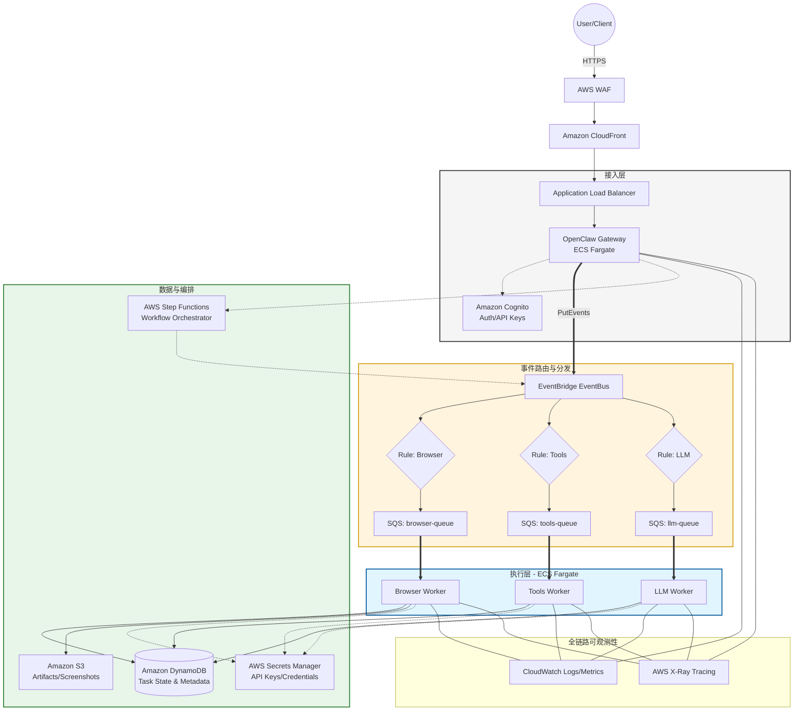

## 架构说明

### 1. 接入层
- **AWS WAF** - Web 应用防火墙，防护恶意请求
- **CloudFront** - CDN 加速与边缘缓存
- **ALB** - 负载均衡，分发到 Gateway 实例
- **OpenClaw Gateway** - 核心网关服务（ECS Fargate）
- **Cognito** - 用户认证与 API Key 管理

### 2. 事件路由与分发
- **EventBridge** - 事件总线，按规则分发任务
- **SQS** - 消息队列，解耦 Gateway 与 Worker

### 3. 执行层
- **Browser Worker** - 浏览器自动化任务
- **Tools Worker** - 工具执行（代码、文件操作等）
- **LLM Worker** - 大模型推理调用

### 4. 数据与编排
- **Step Functions** - 工作流编排
- **DynamoDB** - 任务状态与元数据存储
- **S3** - 文件存储（截图、附件等）
- **Secrets Manager** - 密钥管理

### 5. 可观测性
- **CloudWatch** - 日志与指标
- **X-Ray** - 分布式追踪
