# OpenClaw AWS 增强版架构设计

> 基于 AWS 云原生服务的企业级 AI Agent 平台架构

## 目录

- [架构概览](#架构概览)
- [完整架构图](#完整架构图)
- [分层架构说明](#分层架构说明)
  - [Edge Layer - 边缘层](#1-edge-layer---边缘层)
  - [API Management Layer - API 管理层](#2-api-management-layer---api-管理层)
  - [Ingress Layer - 入口层](#3-ingress-layer---入口层)
  - [Event Routing Layer - 事件路由层](#4-event-routing-layer---事件路由层)
  - [Worker Execution Layer - 工作执行层](#5-worker-execution-layer---工作执行层)
  - [AI/ML Layer - AI/ML 层](#6-aiml-layer---aiml-层)
  - [Data & Orchestration Layer - 数据编排层](#7-data--orchestration-layer---数据编排层)
  - [Security & Compliance Layer - 安全合规层](#8-security--compliance-layer---安全合规层)
  - [Observability Layer - 可观测性层](#9-observability-layer---可观测性层)
  - [CI/CD Layer - 持续集成部署层](#10-cicd-layer---持续集成部署层)
  - [DR Layer - 灾备层](#11-dr-layer---灾备层)
- [数据流设计](#数据流设计)
- [安全设计](#安全设计)
- [成本参考](#成本参考)

---

## 架构概览

本架构采用**事件驱动 + 微服务**模式，针对 AI Agent 工作负载进行优化设计：

| 设计原则 | 实现方式 |
|----------|----------|
| **高可用** | 多 AZ 部署 + 跨区域灾备 + 自动故障转移 |
| **可扩展** | 按队列独立扩缩容 + Fargate Serverless |
| **安全** | 纵深防御 + 零信任 + 全链路加密 |
| **可观测** | 指标 + 日志 + 追踪 + 拨测 四位一体 |
| **解耦** | EventBridge 事件总线 + SQS 消息队列 |

---

## 完整架构图

```mermaid
flowchart TB
    subgraph Internet["🌐 Internet"]
        Users["Users / Clients"]
    end

    subgraph Edge["Edge Layer"]
        R53["Route 53<br/>Health Check + Failover + Latency Routing"]
        Shield["AWS Shield Advanced<br/>DDoS Protection"]
        WAF["AWS WAF<br/>SQL Injection / XSS / Rate Limiting"]
        CF["CloudFront<br/>CDN + Edge Caching"]
        CFF["CloudFront Functions<br/>A/B Testing / Header Manipulation"]
        GA["Global Accelerator<br/>Anycast IP / TCP Optimization"]
    end

    subgraph API["API Management Layer"]
        APIGW["API Gateway<br/>Throttling / Usage Plans / API Keys / Caching"]
    end

    subgraph Ingress["Ingress Layer"]
        ALB["Application Load Balancer<br/>SSL Termination / Path Routing"]
        Gateway["OpenClaw Gateway<br/>ECS Fargate<br/>Blue/Green Deployment"]
        Cognito["Amazon Cognito<br/>User Pools / Identity Pools / MFA"]
        Guardrails["Bedrock Guardrails<br/>Content Filter / PII Masking"]
    end

    subgraph EventRouting["Event Routing Layer"]
        EB["EventBridge EventBus<br/>Schema Registry / Archive / Replay"]

        subgraph Queues["Message Queues"]
            SQS_Browser["SQS: Browser Queue"]
            SQS_Tools["SQS: Tools Queue"]
            SQS_LLM["SQS: LLM Queue (FIFO)"]
            DLQ_Browser["DLQ: Browser"]
            DLQ_Tools["DLQ: Tools"]
            DLQ_LLM["DLQ: LLM"]
        end

        DLQ_Handler["DLQ Handler Lambda<br/>Alerting / Auto Retry"]
    end

    subgraph Workers["Worker Execution Layer"]
        BW["Browser Worker<br/>ECS Fargate<br/>Playwright / Puppeteer"]
        TW["Tools Worker<br/>ECS Fargate<br/>MCP Tools Execution"]
        LW["LLM Worker<br/>ECS Fargate<br/>Model Orchestration"]
    end

    subgraph AI["AI/ML Layer"]
        Bedrock["Amazon Bedrock<br/>Claude / Titan / Mistral<br/>Prompt Caching"]
        ModelGW["Model Gateway<br/>Multi-Model Routing / Fallback"]
        OpenSearch["OpenSearch Serverless<br/>Vector DB for RAG"]
        SageMaker["SageMaker Endpoint<br/>Custom Fine-tuned Models"]
    end

    subgraph Data["Data & Orchestration Layer"]
        subgraph Storage["Storage"]
            DDB["DynamoDB Global Tables<br/>Task State / Session"]
            DAX["DynamoDB DAX<br/>Microsecond Reads"]
            S3["S3<br/>Artifacts / Screenshots / Logs"]
            S3_CRR["S3 Cross-Region Replication"]
        end

        subgraph Cache["Caching"]
            Redis["ElastiCache Redis Cluster<br/>Session / API Cache / Distributed Lock"]
        end

        subgraph Orchestration["Orchestration"]
            SF["Step Functions<br/>Workflow Orchestrator"]
            AppConfig["AppConfig<br/>Feature Flags / Canary Release"]
        end
    end

    subgraph Security["Security & Compliance Layer"]
        SM["Secrets Manager<br/>API Keys / Credentials"]
        KMS["KMS CMK<br/>Encryption Keys"]
        GD["GuardDuty<br/>Threat Detection"]
        SH["Security Hub<br/>Security Posture"]
        Inspector["Inspector<br/>Container Vulnerability Scan"]
        Macie["Macie<br/>S3 PII Detection"]
        Config["AWS Config<br/>Compliance Rules"]
        CT["CloudTrail Lake<br/>API Audit Logs"]
        AA["IAM Access Analyzer<br/>Permission Analysis"]
        NF["Network Firewall<br/>VPC Deep Packet Inspection"]
    end

    subgraph Observability["Observability Layer"]
        CW["CloudWatch<br/>Logs / Metrics / Alarms"]
        XRay["X-Ray<br/>Distributed Tracing"]
        Prometheus["Managed Prometheus<br/>Metrics Storage"]
        Grafana["Managed Grafana<br/>Unified Dashboard"]
        Synthetics["CloudWatch Synthetics<br/>Canary Monitoring"]
        RUM["CloudWatch RUM<br/>Real User Monitoring"]
        CI["Contributor Insights<br/>Top-N Analysis"]
    end

    subgraph CICD["CI/CD Layer"]
        CodePipeline["CodePipeline<br/>Release Orchestration"]
        CodeBuild["CodeBuild<br/>Build + Test"]
        ECR["ECR<br/>Container Registry + Scan"]
        CodeDeploy["CodeDeploy<br/>Blue/Green / Canary"]
    end

    subgraph DR["DR Region (us-west-2)"]
        DR_Gateway["Gateway (Pilot Light)"]
        DR_Workers["Workers (Scaled to 0)"]
        DR_DDB["DynamoDB Replica"]
        DR_S3["S3 Replica"]
    end

    subgraph Cost["Cost Management"]
        CostExplorer["Cost Explorer"]
        Budgets["Budgets + Alerts"]
        ComputeOpt["Compute Optimizer"]
    end

    %% Connections - Edge
    Users --> R53
    R53 --> Shield
    Shield --> WAF
    WAF --> CF
    CF --> CFF
    CFF --> GA
    GA --> APIGW

    %% Connections - Ingress
    APIGW --> ALB
    ALB --> Gateway
    Gateway <--> Cognito
    Gateway <--> Guardrails
    Gateway --> EB

    %% Connections - Event Routing
    EB --> SQS_Browser
    EB --> SQS_Tools
    EB --> SQS_LLM
    SQS_Browser -.-> DLQ_Browser
    SQS_Tools -.-> DLQ_Tools
    SQS_LLM -.-> DLQ_LLM
    DLQ_Browser --> DLQ_Handler
    DLQ_Tools --> DLQ_Handler
    DLQ_LLM --> DLQ_Handler

    %% Connections - Workers
    SQS_Browser --> BW
    SQS_Tools --> TW
    SQS_LLM --> LW

    %% Connections - AI
    LW --> ModelGW
    ModelGW --> Bedrock
    ModelGW --> SageMaker
    LW --> OpenSearch
    BW --> OpenSearch
    TW --> OpenSearch

    %% Connections - Data
    Gateway --> DDB
    BW --> DDB
    TW --> DDB
    LW --> DDB
    DDB --> DAX
    Gateway --> Redis
    BW --> S3
    TW --> S3
    S3 --> S3_CRR
    SF --> BW
    SF --> TW
    SF --> LW
    Gateway --> AppConfig

    %% Connections - Security
    Gateway --> SM
    SM --> KMS
    DDB --> KMS
    S3 --> KMS

    %% Connections - DR
    DDB -.->|Global Tables| DR_DDB
    S3_CRR -.-> DR_S3
    R53 -.->|Failover| DR_Gateway

    %% Connections - Observability
    Gateway --> CW
    BW --> CW
    TW --> CW
    LW --> CW
    CW --> Prometheus
    Prometheus --> Grafana
    Gateway --> XRay
    BW --> XRay
    TW --> XRay
    LW --> XRay

    %% Connections - CI/CD
    CodePipeline --> CodeBuild
    CodeBuild --> ECR
    ECR --> CodeDeploy
    CodeDeploy --> Gateway
    CodeDeploy --> BW
    CodeDeploy --> TW
    CodeDeploy --> LW

    %% Styling
    classDef edge fill:#ff9900,stroke:#232f3e,color:#232f3e
    classDef security fill:#dd344c,stroke:#232f3e,color:#fff
    classDef compute fill:#ed7100,stroke:#232f3e,color:#232f3e
    classDef storage fill:#3b48cc,stroke:#232f3e,color:#fff
    classDef ai fill:#01a88d,stroke:#232f3e,color:#fff
    classDef observability fill:#c925d1,stroke:#232f3e,color:#fff
    classDef dr fill:#7d8998,stroke:#232f3e,color:#fff

    class R53,Shield,WAF,CF,CFF,GA edge
    class SM,KMS,GD,SH,Inspector,Macie,Config,CT,AA,NF,Cognito,Guardrails security
    class Gateway,BW,TW,LW,ALB compute
    class DDB,DAX,S3,S3_CRR,Redis storage
    class Bedrock,ModelGW,OpenSearch,SageMaker ai
    class CW,XRay,Prometheus,Grafana,Synthetics,RUM,CI observability
    class DR_Gateway,DR_Workers,DR_DDB,DR_S3 dr
```



---

## 分层架构说明

### 1. Edge Layer - 边缘层

负责全球流量接入、DDoS 防护和边缘加速。

| 组件 | 服务 | 职责 |
|------|------|------|
| DNS | Route 53 | 健康检查、故障转移路由、延迟路由 |
| DDoS 防护 | Shield Advanced | L3/L4/L7 DDoS 防护，含 DRT 团队支持 |
| Web 防火墙 | WAF | SQL 注入、XSS、恶意 Bot、速率限制 |
| CDN | CloudFront | 静态资源缓存、HTTPS 终结 |
| 边缘计算 | CloudFront Functions | A/B 测试、请求头处理、URL 重写 |
| 全球加速 | Global Accelerator | Anycast IP、TCP 优化、最近 POP 接入 |

**配置要点：**

```yaml
# WAF 规则组
- AWSManagedRulesCommonRuleSet      # OWASP Top 10
- AWSManagedRulesKnownBadInputsRuleSet
- AWSManagedRulesSQLiRuleSet
- AWSManagedRulesAmazonIpReputationList
- RateLimitRule: 2000 req/5min/IP
```

---

### 2. API Management Layer - API 管理层

统一 API 入口，提供限流、配额、缓存等能力。

| 功能 | 配置 |
|------|------|
| 限流 | 10,000 TPS (可按客户调整) |
| Usage Plans | Free / Standard / Enterprise |
| API Keys | 按客户分配，关联 Usage Plan |
| 缓存 | TTL 300s (GET 请求) |
| 请求校验 | JSON Schema Validation |

**API 版本管理：**

```
/v1/tasks      → 稳定版
/v2/tasks      → 新特性版
/beta/tasks    → 实验版
```

---

### 3. Ingress Layer - 入口层

处理认证授权、内容过滤和请求路由。

| 组件 | 服务 | 职责 |
|------|------|------|
| 负载均衡 | ALB | SSL 终结、路径路由、健康检查 |
| 网关 | OpenClaw Gateway (Fargate) | 请求处理、事件发布 |
| 认证 | Cognito | 用户池、身份池、MFA、OAuth2/OIDC |
| 内容过滤 | Bedrock Guardrails | 有害内容过滤、PII 脱敏、话题限制 |

**Cognito 配置：**

```yaml
UserPool:
  MFA: Required (TOTP)
  PasswordPolicy:
    MinLength: 12
    RequireSymbols: true
  AdvancedSecurity: ENFORCED  # 异常登录检测

IdentityPool:
  AuthenticatedRole: openclaw-user-role
  UnauthenticatedRole: denied
```

**Guardrails 配置：**

```yaml
ContentFilters:
  - HATE: HIGH
  - INSULTS: HIGH
  - SEXUAL: HIGH
  - VIOLENCE: HIGH

PIIFilters:
  - EMAIL: ANONYMIZE
  - PHONE: ANONYMIZE
  - SSN: BLOCK

TopicFilters:
  - "illegal activities": BLOCK
  - "harmful instructions": BLOCK
```

---

### 4. Event Routing Layer - 事件路由层

实现服务解耦和异步处理。

| 组件 | 服务 | 职责 |
|------|------|------|
| 事件总线 | EventBridge | 事件路由、Schema 管理、存档重放 |
| 消息队列 | SQS Standard | Browser/Tools 任务队列 |
| 消息队列 | SQS FIFO | LLM 任务队列 (保序) |
| 死信队列 | SQS DLQ | 失败消息存储 |
| 失败处理 | Lambda | DLQ 告警、自动重试 |

**EventBridge 规则示例：**

```json
{
  "source": ["openclaw.gateway"],
  "detail-type": ["TaskCreated"],
  "detail": {
    "taskType": ["browser"]
  }
}
→ Target: SQS Browser Queue
```

**SQS 配置：**

```yaml
BrowserQueue:
  VisibilityTimeout: 900s    # 15分钟 (浏览器任务耗时长)
  MessageRetention: 7 days
  MaxReceiveCount: 3         # 失败3次进 DLQ

LLMQueue:
  FifoQueue: true
  ContentBasedDeduplication: true
  VisibilityTimeout: 120s
```

---

### 5. Worker Execution Layer - 工作执行层

独立扩缩容的任务执行单元。

| Worker | 职责 | 资源配置 | 扩缩容策略 |
|--------|------|----------|------------|
| Browser Worker | 网页自动化 (Playwright) | 2 vCPU / 4GB | 基于 SQS 队列深度 |
| Tools Worker | MCP 工具执行 | 1 vCPU / 2GB | 基于 SQS 队列深度 |
| LLM Worker | 模型调用编排 | 1 vCPU / 2GB | 基于 SQS 队列深度 |

**Fargate Service 配置：**

```yaml
BrowserWorkerService:
  DesiredCount: 2
  MinCapacity: 1
  MaxCapacity: 50
  ScalingPolicy:
    TargetValue: 5           # 每个任务5个消息
    ScaleInCooldown: 60s
    ScaleOutCooldown: 30s

  # 蓝绿部署
  DeploymentController: CODE_DEPLOY
  DeploymentConfiguration:
    MaximumPercent: 200
    MinimumHealthyPercent: 100
```

---

### 6. AI/ML Layer - AI/ML 层

多模型支持和 RAG 检索增强。

| 组件 | 服务 | 职责 |
|------|------|------|
| 模型网关 | 自建 | 多模型路由、故障切换、成本优化 |
| 基础模型 | Bedrock | Claude / Titan / Mistral |
| 自定义模型 | SageMaker | 微调模型部署 |
| 向量检索 | OpenSearch Serverless | RAG 知识库 |

**Model Gateway 路由策略：**

```yaml
Routes:
  - name: primary
    model: anthropic.claude-3-5-sonnet
    weight: 80

  - name: fallback
    model: anthropic.claude-3-haiku
    weight: 20
    conditions:
      - type: latency
        threshold: 5000ms
      - type: error_rate
        threshold: 5%

PromptCaching:
  enabled: true
  ttl: 3600s
```

**OpenSearch 向量索引：**

```json
{
  "settings": {
    "index.knn": true
  },
  "mappings": {
    "properties": {
      "embedding": {
        "type": "knn_vector",
        "dimension": 1536,
        "method": {
          "name": "hnsw",
          "space_type": "cosinesimil",
          "engine": "nmslib"
        }
      }
    }
  }
}
```

---

### 7. Data & Orchestration Layer - 数据编排层

状态存储、缓存和工作流编排。

| 组件 | 服务 | 职责 |
|------|------|------|
| 主存储 | DynamoDB Global Tables | 任务状态、会话数据 |
| 读加速 | DAX | 微秒级读取缓存 |
| 对象存储 | S3 | 截图、产物、日志 |
| 应用缓存 | ElastiCache Redis | Session、API 缓存、分布式锁 |
| 工作流 | Step Functions | 复杂任务编排 |
| 配置 | AppConfig | Feature Flags、灰度发布 |

**DynamoDB 表设计：**

```yaml
TasksTable:
  PartitionKey: PK (String)    # TASK#<task_id>
  SortKey: SK (String)         # METADATA | STEP#<step_id>
  GSI1:
    PartitionKey: GSI1PK       # USER#<user_id>
    SortKey: GSI1SK            # <created_at>
  GSI2:
    PartitionKey: status       # pending | running | completed
    SortKey: created_at

  StreamEnabled: true          # 用于事件触发
  PointInTimeRecovery: true
  GlobalTableRegions:
    - us-east-1
    - us-west-2
```

**Redis 使用场景：**

```python
# Session 缓存
SET session:{session_id} {data} EX 3600

# API 响应缓存
SET api:v1:tasks:{hash} {response} EX 300

# 分布式锁 (任务去重)
SET lock:task:{task_id} {worker_id} NX EX 900

# 速率限制
INCR ratelimit:{user_id}:{window}
EXPIRE ratelimit:{user_id}:{window} 60
```

---

### 8. Security & Compliance Layer - 安全合规层

纵深防御和合规审计。

| 组件 | 服务 | 职责 |
|------|------|------|
| 密钥管理 | Secrets Manager | API Key、数据库凭证 |
| 加密 | KMS CMK | 数据加密密钥管理 |
| 威胁检测 | GuardDuty | 异常 API 调用、恶意 IP |
| 态势管理 | Security Hub | 安全发现聚合、合规检查 |
| 漏洞扫描 | Inspector | 容器镜像 CVE 扫描 |
| 数据发现 | Macie | S3 敏感数据检测 |
| 配置合规 | Config Rules | 资源配置持续检查 |
| 审计日志 | CloudTrail Lake | API 调用记录、SQL 查询 |
| 权限分析 | Access Analyzer | IAM 过度权限检测 |
| 网络安全 | Network Firewall | VPC 深度包检测 |

**IAM 最小权限示例：**

```json
{
  "Version": "2012-10-17",
  "Statement": [
    {
      "Effect": "Allow",
      "Action": [
        "secretsmanager:GetSecretValue"
      ],
      "Resource": "arn:aws:secretsmanager:*:*:secret:openclaw/*"
    },
    {
      "Effect": "Allow",
      "Action": [
        "bedrock:InvokeModel"
      ],
      "Resource": [
        "arn:aws:bedrock:*::foundation-model/anthropic.claude-*"
      ]
    }
  ]
}
```

**Security Hub 标准：**

```yaml
EnabledStandards:
  - AWS Foundational Security Best Practices
  - CIS AWS Foundations Benchmark
  - PCI DSS
```

---

### 9. Observability Layer - 可观测性层

指标、日志、追踪、拨测四位一体。

| 组件 | 服务 | 职责 |
|------|------|------|
| 日志 | CloudWatch Logs | 集中日志存储 |
| 指标 | CloudWatch Metrics | 系统和业务指标 |
| 告警 | CloudWatch Alarms | 异常告警通知 |
| 追踪 | X-Ray | 分布式链路追踪 |
| 指标存储 | Managed Prometheus | 长期指标存储 |
| 可视化 | Managed Grafana | 统一监控大盘 |
| 拨测 | Synthetics | 端到端可用性监控 |
| 用户体验 | RUM | 真实用户性能监控 |
| 分析 | Contributor Insights | Top-N 热点分析 |

**关键告警配置：**

```yaml
Alarms:
  - Name: HighErrorRate
    Metric: 5xxErrors
    Threshold: 1%
    Period: 300s
    Action: SNS → PagerDuty

  - Name: HighLatency
    Metric: p99Latency
    Threshold: 5000ms
    Period: 300s

  - Name: DLQNotEmpty
    Metric: ApproximateNumberOfMessagesVisible
    Threshold: 1
    Queue: *-dlq

  - Name: LLMQuotaWarning
    Metric: BedrockThrottledRequests
    Threshold: 10
    Period: 60s
```

**Grafana Dashboard 布局：**

```
┌─────────────────────────────────────────────────────────────┐
│                    OpenClaw Overview                         │
├───────────────┬───────────────┬───────────────┬─────────────┤
│ Request Rate  │ Error Rate    │ P99 Latency   │ Active Tasks│
│   12.5K/min   │    0.12%      │    1.2s       │    156      │
├───────────────┴───────────────┴───────────────┴─────────────┤
│                    Request Flow                              │
│  [Gateway] ──→ [EventBridge] ──→ [Workers] ──→ [Bedrock]   │
├─────────────────────────────────────────────────────────────┤
│ Worker Status          │ Queue Depth                        │
│ Browser: 5/50 (10%)    │ Browser: 23 ████░░░░               │
│ Tools:   3/20 (15%)    │ Tools:   12 ██░░░░░░               │
│ LLM:     8/30 (27%)    │ LLM:     45 ██████░░               │
├─────────────────────────────────────────────────────────────┤
│ LLM Metrics                                                  │
│ Token Usage: 1.2M/day  │ Avg Latency: 800ms │ Cache Hit: 34%│
└─────────────────────────────────────────────────────────────┘
```

---

### 10. CI/CD Layer - 持续集成部署层

自动化构建、测试和部署。

| 组件 | 服务 | 职责 |
|------|------|------|
| 流水线 | CodePipeline | 发布编排 |
| 构建 | CodeBuild | 编译、测试、打包 |
| 镜像仓库 | ECR | 容器镜像存储 + 漏洞扫描 |
| 部署 | CodeDeploy | 蓝绿/金丝雀部署 |

**Pipeline 流程：**

```
┌──────────┐    ┌──────────┐    ┌──────────┐    ┌──────────┐
│  Source  │───▶│  Build   │───▶│  Test    │───▶│  Deploy  │
│  (GitHub)│    │(CodeBuild)    │(CodeBuild)    │(CodeDeploy)
└──────────┘    └──────────┘    └──────────┘    └──────────┘
                     │               │               │
                     ▼               ▼               ▼
              - Docker Build   - Unit Tests    - Blue/Green
              - ECR Push       - Integration   - 10% Canary
              - Vuln Scan      - E2E Tests     - Health Check
                                               - 100% Rollout
```

**CodeDeploy 配置：**

```yaml
DeploymentConfig:
  Type: Blue/Green

  TrafficRouting:
    Type: TimeBasedCanary
    CanaryInterval: 5        # 5分钟
    CanaryPercentage: 10     # 先切 10% 流量

  TerminationWait: 60        # 旧版本保留 60 分钟

  AutoRollback:
    Enabled: true
    Events:
      - DEPLOYMENT_FAILURE
      - DEPLOYMENT_STOP_ON_ALARM
```

---

### 11. DR Layer - 灾备层

跨区域灾难恢复。

| 策略 | 实现 | RPO | RTO |
|------|------|-----|-----|
| **数据同步** | DynamoDB Global Tables | ~0 | ~0 |
| **对象复制** | S3 Cross-Region Replication | 15 min | ~0 |
| **计算** | Pilot Light (Fargate DesiredCount=0) | N/A | 5 min |
| **流量切换** | Route 53 Failover | N/A | 60s |

**DR 架构：**

```
┌─────────────────────────────┐     ┌─────────────────────────────┐
│     Primary (us-east-1)     │     │       DR (us-west-2)        │
│                             │     │                             │
│  ┌─────────────────────┐   │     │   ┌─────────────────────┐   │
│  │ Gateway (Active)    │   │     │   │ Gateway (Standby)   │   │
│  │ DesiredCount: 2     │   │     │   │ DesiredCount: 0     │   │
│  └─────────────────────┘   │     │   └─────────────────────┘   │
│            │                │     │            │                │
│            ▼                │     │            ▼                │
│  ┌─────────────────────┐   │     │   ┌─────────────────────┐   │
│  │ DynamoDB (Primary)  │◀──┼─────┼──▶│ DynamoDB (Replica)  │   │
│  └─────────────────────┘   │     │   └─────────────────────┘   │
│                             │     │                             │
│  ┌─────────────────────┐   │     │   ┌─────────────────────┐   │
│  │ S3 (Primary)        │───┼─────┼──▶│ S3 (Replica)        │   │
│  └─────────────────────┘   │     │   └─────────────────────┘   │
└─────────────────────────────┘     └─────────────────────────────┘
              │                                   │
              └──────────┬────────────────────────┘
                         │
                ┌────────▼────────┐
                │   Route 53      │
                │ Health Check    │
                │ Failover Policy │
                └─────────────────┘
```

**故障转移流程：**

1. Route 53 Health Check 检测主区域不可用
2. DNS 自动切换到 DR 区域
3. EventBridge 触发 Lambda 扩容 DR Fargate Services
4. 60 秒内完成流量切换

---

## 数据流设计

### 任务处理流程

```
用户请求
    │
    ▼
┌──────────────────────────────────────────────────────────────┐
│ 1. Edge Layer                                                 │
│    Route 53 → Shield → WAF → CloudFront → Global Accelerator │
└──────────────────────────────────────────────────────────────┘
    │
    ▼
┌──────────────────────────────────────────────────────────────┐
│ 2. API Gateway                                                │
│    认证 (API Key) → 限流检查 → 请求校验 → 缓存查询           │
└──────────────────────────────────────────────────────────────┘
    │
    ▼
┌──────────────────────────────────────────────────────────────┐
│ 3. Ingress Layer                                              │
│    ALB → Gateway                                              │
│         ├─→ Cognito (用户认证)                                │
│         ├─→ Guardrails (内容检查)                             │
│         ├─→ DynamoDB (创建任务记录)                           │
│         └─→ EventBridge (发布 TaskCreated 事件)               │
└──────────────────────────────────────────────────────────────┘
    │
    ▼
┌──────────────────────────────────────────────────────────────┐
│ 4. Event Routing                                              │
│    EventBridge 根据 taskType 路由:                            │
│         ├─→ browser → SQS Browser Queue                       │
│         ├─→ tools   → SQS Tools Queue                         │
│         └─→ llm     → SQS LLM Queue (FIFO)                    │
└──────────────────────────────────────────────────────────────┘
    │
    ▼
┌──────────────────────────────────────────────────────────────┐
│ 5. Worker Execution                                           │
│    Worker 拉取消息:                                           │
│         ├─→ 更新任务状态 (DynamoDB)                           │
│         ├─→ 执行任务 (Browser/Tools/LLM)                      │
│         ├─→ 存储产物 (S3)                                     │
│         └─→ 发布 TaskCompleted 事件                           │
└──────────────────────────────────────────────────────────────┘
    │
    ▼
┌──────────────────────────────────────────────────────────────┐
│ 6. 结果返回                                                   │
│    Gateway 轮询任务状态 或 WebSocket 推送                      │
└──────────────────────────────────────────────────────────────┘
```

---

## 安全设计

### 安全层次模型

```
┌─────────────────────────────────────────────────────────────────┐
│ Layer 1: 边界防护                                               │
│ Shield Advanced + WAF + Network Firewall                        │
├─────────────────────────────────────────────────────────────────┤
│ Layer 2: 身份认证                                               │
│ Cognito (MFA) + API Gateway (API Keys) + IAM Roles              │
├─────────────────────────────────────────────────────────────────┤
│ Layer 3: 内容安全                                               │
│ Bedrock Guardrails (有害内容过滤 + PII 脱敏)                    │
├─────────────────────────────────────────────────────────────────┤
│ Layer 4: 数据加密                                               │
│ KMS CMK (静态加密) + TLS 1.3 (传输加密) + PrivateLink           │
├─────────────────────────────────────────────────────────────────┤
│ Layer 5: 威胁检测                                               │
│ GuardDuty + Security Hub + Inspector + Macie                    │
├─────────────────────────────────────────────────────────────────┤
│ Layer 6: 审计合规                                               │
│ CloudTrail Lake + Config Rules + Access Analyzer                │
└─────────────────────────────────────────────────────────────────┘
```

### 网络隔离

```
┌─────────────────────────────────────────────────────────────────┐
│                          VPC (10.0.0.0/16)                      │
│  ┌────────────────────────────────────────────────────────────┐ │
│  │ Public Subnets (10.0.1.0/24, 10.0.2.0/24)                  │ │
│  │   - ALB                                                     │ │
│  │   - NAT Gateway                                             │ │
│  └────────────────────────────────────────────────────────────┘ │
│  ┌────────────────────────────────────────────────────────────┐ │
│  │ Private Subnets (10.0.10.0/24, 10.0.20.0/24)               │ │
│  │   - ECS Fargate Tasks                                       │ │
│  │   - ElastiCache                                             │ │
│  └────────────────────────────────────────────────────────────┘ │
│  ┌────────────────────────────────────────────────────────────┐ │
│  │ VPC Endpoints (PrivateLink)                                 │ │
│  │   - Bedrock, DynamoDB, S3, Secrets Manager, ECR, SQS       │ │
│  └────────────────────────────────────────────────────────────┘ │
└─────────────────────────────────────────────────────────────────┘
```

---

## 成本参考

> 注：以下为 us-east-1 区域月度估算，实际成本因使用量而异

| 类别 | 服务 | 月估算 (USD) |
|------|------|-------------|
| **计算** | Fargate (Gateway + Workers) | $800 - $2,000 |
| **网络** | CloudFront + Global Accelerator + NAT | $200 - $500 |
| **存储** | DynamoDB + S3 + ElastiCache | $300 - $800 |
| **AI/ML** | Bedrock + OpenSearch | $1,000 - $5,000 |
| **安全** | Shield Adv + WAF + GuardDuty | $3,000 + $100 + $50 |
| **监控** | CloudWatch + X-Ray + Grafana | $200 - $500 |
| **其他** | Secrets Manager + KMS + Route 53 | $50 - $100 |
| **总计** | | **$5,700 - $12,000+** |

---

## 下一步

- [ ] 高级玩法：App Mesh 服务网格
- [ ] 高级玩法：Fault Injection Simulator 混沌工程
- [ ] 高级玩法：Kinesis 实时数据流
- [ ] 高级玩法：Lake Formation 数据湖
- [ ] IaC 实现 (CDK / Terraform)

---

*Generated for OpenClaw Architecture POC*
