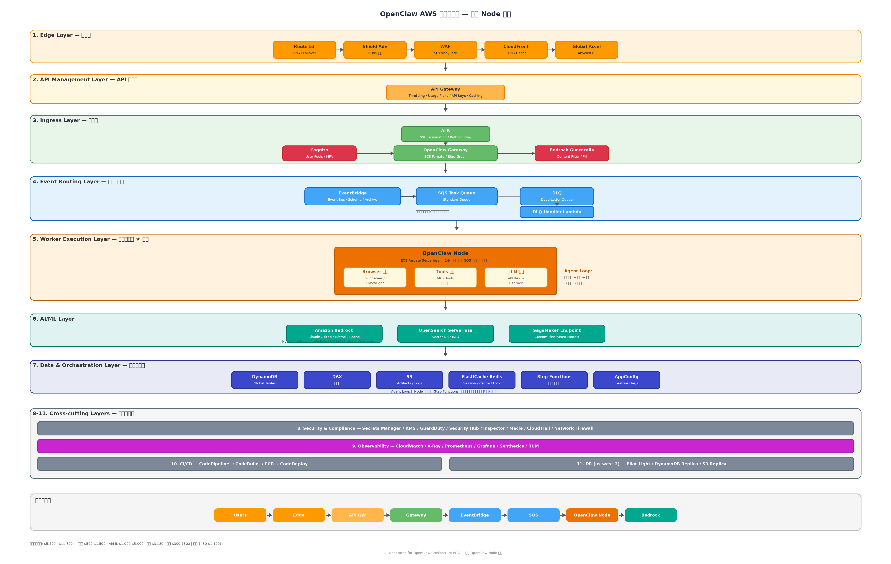
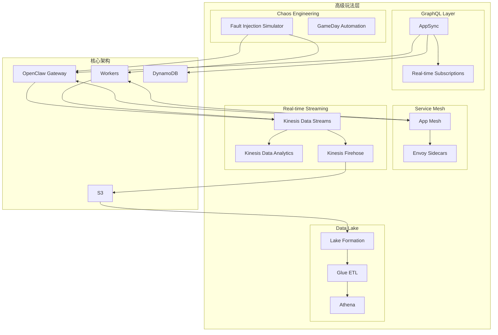

# OpenClaw AWS 增强版架构设计

> 基于 AWS 云原生服务的企业级 AI Agent 平台架构

## 目录

- [架构概览](#架构概览)
- [完整架构图](#完整架构图)
- [分层架构说明](#分层架构说明)
  - [Edge Layer - 边缘层](#1-edge-layer---边缘层)
  - [API Management Layer - API 管理层](#2-api-management-layer---api-管理层)
  - [Ingress Layer - 入口层](#3-ingress-layer---入口层)
  - [Event Routing Layer - 事件路由层](#4-event-routing-layer---事件路由层)
  - [Worker Execution Layer - 工作执行层](#5-worker-execution-layer---工作执行层)
  - [AI/ML Layer - AI/ML 层](#6-aiml-layer---aiml-层)
  - [Data & Orchestration Layer - 数据编排层](#7-data--orchestration-layer---数据编排层)
  - [Security & Compliance Layer - 安全合规层](#8-security--compliance-layer---安全合规层)
  - [Observability Layer - 可观测性层](#9-observability-layer---可观测性层)
  - [CI/CD Layer - 持续集成部署层](#10-cicd-layer---持续集成部署层)
  - [DR Layer - 灾备层](#11-dr-layer---灾备层)
- [数据流设计](#数据流设计)
- [安全设计](#安全设计)
- [成本参考](#成本参考)

---

## 架构概览

本架构采用**事件驱动 + 微服务**模式，针对 AI Agent 工作负载进行优化设计：

| 设计原则 | 实现方式 |
|----------|----------|
| **高可用** | 多 AZ 部署 + 跨区域灾备 + 自动故障转移 |
| **可扩展** | 按队列深度统一扩缩容 + Fargate Serverless |
| **安全** | 纵深防御 + 零信任 + 全链路加密 |
| **可观测** | 指标 + 日志 + 追踪 + 拨测 四位一体 |
| **解耦** | EventBridge 事件总线 + SQS 消息队列 |

---

## 完整架构图

```mermaid
flowchart TB
    subgraph Internet["🌐 Internet"]
        Users["Users / Clients"]
    end

    subgraph Edge["Edge Layer"]
        R53["Route 53<br/>Health Check + Failover + Latency Routing"]
        Shield["AWS Shield Advanced<br/>DDoS Protection"]
        WAF["AWS WAF<br/>SQL Injection / XSS / Rate Limiting"]
        CF["CloudFront<br/>CDN + Edge Caching"]
        CFF["CloudFront Functions<br/>A/B Testing / Header Manipulation"]
        GA["Global Accelerator<br/>Anycast IP / TCP Optimization"]
    end

    subgraph API["API Management Layer"]
        APIGW["API Gateway<br/>Throttling / Usage Plans / API Keys / Caching"]
    end

    subgraph Ingress["Ingress Layer"]
        ALB["Application Load Balancer<br/>SSL Termination / Path Routing"]
        Gateway["OpenClaw Gateway<br/>ECS Fargate<br/>Blue/Green Deployment"]
        Cognito["Amazon Cognito<br/>User Pools / Identity Pools / MFA"]
        Guardrails["Bedrock Guardrails<br/>Content Filter / PII Masking"]
    end

    subgraph EventRouting["Event Routing Layer"]
        EB["EventBridge EventBus<br/>Schema Registry / Archive / Replay"]

        subgraph Queues["Message Queues"]
            SQS_Task["SQS: Task Queue<br/>Standard Queue"]
            DLQ_Task["DLQ: Task Dead Letter Queue"]
        end

        DLQ_Handler["DLQ Handler Lambda<br/>Alerting / Auto Retry"]
    end

    subgraph Workers["Worker Execution Layer"]
        Node["OpenClaw Node<br/>ECS Fargate<br/>Browser + Tools + LLM<br/>Agent Loop"]
    end

    subgraph AI["AI/ML Layer"]
        Bedrock["Amazon Bedrock<br/>Claude / Titan / Mistral<br/>Prompt Caching"]
        OpenSearch["OpenSearch Serverless<br/>Vector DB for RAG"]
        SageMaker["SageMaker Endpoint<br/>Custom Fine-tuned Models"]
    end

    subgraph Data["Data & Orchestration Layer"]
        subgraph Storage["Storage"]
            DDB["DynamoDB Global Tables<br/>Task State / Session"]
            DAX["DynamoDB DAX<br/>Microsecond Reads"]
            S3["S3<br/>Artifacts / Screenshots / Logs"]
            S3_CRR["S3 Cross-Region Replication"]
        end

        subgraph Cache["Caching"]
            Redis["ElastiCache Redis Cluster<br/>Session / API Cache / Distributed Lock"]
        end

        subgraph Orchestration["Orchestration"]
            SF["Step Functions<br/>Task Lifecycle Management"]
            AppConfig["AppConfig<br/>Feature Flags / Canary Release"]
        end
    end

    subgraph Security["Security & Compliance Layer"]
        SM["Secrets Manager<br/>API Keys / Credentials"]
        KMS["KMS CMK<br/>Encryption Keys"]
        GD["GuardDuty<br/>Threat Detection"]
        SH["Security Hub<br/>Security Posture"]
        Inspector["Inspector<br/>Container Vulnerability Scan"]
        Macie["Macie<br/>S3 PII Detection"]
        Config["AWS Config<br/>Compliance Rules"]
        CT["CloudTrail Lake<br/>API Audit Logs"]
        AA["IAM Access Analyzer<br/>Permission Analysis"]
        NF["Network Firewall<br/>VPC Deep Packet Inspection"]
    end

    subgraph Observability["Observability Layer"]
        CW["CloudWatch<br/>Logs / Metrics / Alarms"]
        XRay["X-Ray<br/>Distributed Tracing"]
        Prometheus["Managed Prometheus<br/>Metrics Storage"]
        Grafana["Managed Grafana<br/>Unified Dashboard"]
        Synthetics["CloudWatch Synthetics<br/>Canary Monitoring"]
        RUM["CloudWatch RUM<br/>Real User Monitoring"]
        CI["Contributor Insights<br/>Top-N Analysis"]
    end

    subgraph CICD["CI/CD Layer"]
        CodePipeline["CodePipeline<br/>Release Orchestration"]
        CodeBuild["CodeBuild<br/>Build + Test"]
        ECR["ECR<br/>Container Registry + Scan"]
        CodeDeploy["CodeDeploy<br/>Blue/Green / Canary"]
    end

    subgraph DR["DR Region (us-west-2)"]
        DR_Gateway["Gateway (Pilot Light)"]
        DR_Node["OpenClaw Node (Scaled to 0)"]
        DR_DDB["DynamoDB Replica"]
        DR_S3["S3 Replica"]
    end

    subgraph Cost["Cost Management"]
        CostExplorer["Cost Explorer"]
        Budgets["Budgets + Alerts"]
        ComputeOpt["Compute Optimizer"]
    end

    %% Connections - Edge
    Users --> R53
    R53 --> Shield
    Shield --> WAF
    WAF --> CF
    CF --> CFF
    CFF --> GA
    GA --> APIGW

    %% Connections - Ingress
    APIGW --> ALB
    ALB --> Gateway
    Gateway <--> Cognito
    Gateway <--> Guardrails
    Gateway --> EB

    %% Connections - Event Routing
    EB --> SQS_Task
    SQS_Task -.-> DLQ_Task
    DLQ_Task --> DLQ_Handler

    %% Connections - Workers
    SQS_Task --> Node

    %% Connections - AI
    Node --> Bedrock
    Node --> SageMaker
    Node --> OpenSearch

    %% Connections - Data
    Gateway --> DDB
    Node --> DDB
    DDB --> DAX
    Gateway --> Redis
    Node --> Redis
    Node --> S3
    S3 --> S3_CRR
    SF --> Node
    Gateway --> AppConfig

    %% Connections - Security
    Gateway --> SM
    SM --> KMS
    DDB --> KMS
    S3 --> KMS

    %% Connections - DR
    DDB -.->|Global Tables| DR_DDB
    S3_CRR -.-> DR_S3
    R53 -.->|Failover| DR_Gateway

    %% Connections - Observability
    Gateway --> CW
    Node --> CW
    CW --> Prometheus
    Prometheus --> Grafana
    Gateway --> XRay
    Node --> XRay

    %% Connections - CI/CD
    CodePipeline --> CodeBuild
    CodeBuild --> ECR
    ECR --> CodeDeploy
    CodeDeploy --> Gateway
    CodeDeploy --> Node

    %% Styling
    classDef edge fill:#ff9900,stroke:#232f3e,color:#232f3e
    classDef security fill:#dd344c,stroke:#232f3e,color:#fff
    classDef compute fill:#ed7100,stroke:#232f3e,color:#232f3e
    classDef storage fill:#3b48cc,stroke:#232f3e,color:#fff
    classDef ai fill:#01a88d,stroke:#232f3e,color:#fff
    classDef observability fill:#c925d1,stroke:#232f3e,color:#fff
    classDef dr fill:#7d8998,stroke:#232f3e,color:#fff

    class R53,Shield,WAF,CF,CFF,GA edge
    class SM,KMS,GD,SH,Inspector,Macie,Config,CT,AA,NF,Cognito,Guardrails security
    class Gateway,Node,ALB compute
    class DDB,DAX,S3,S3_CRR,Redis storage
    class Bedrock,OpenSearch,SageMaker ai
    class CW,XRay,Prometheus,Grafana,Synthetics,RUM,CI observability
    class DR_Gateway,DR_Node,DR_DDB,DR_S3 dr
```



<details>
<summary>Mermaid 源码（点击展开）</summary>



</details>

---

## 分层架构说明

### 1. Edge Layer - 边缘层

负责全球流量接入、DDoS 防护和边缘加速。

| 组件 | 服务 | 职责 |
|------|------|------|
| DNS | Route 53 | 健康检查、故障转移路由、延迟路由 |
| DDoS 防护 | Shield Advanced | L3/L4/L7 DDoS 防护，含 DRT 团队支持 |
| Web 防火墙 | WAF | SQL 注入、XSS、恶意 Bot、速率限制 |
| CDN | CloudFront | 静态资源缓存、HTTPS 终结 |
| 边缘计算 | CloudFront Functions | A/B 测试、请求头处理、URL 重写 |
| 全球加速 | Global Accelerator | Anycast IP、TCP 优化、最近 POP 接入 |

**配置要点：**

```yaml
# WAF 规则组
- AWSManagedRulesCommonRuleSet      # OWASP Top 10
- AWSManagedRulesKnownBadInputsRuleSet
- AWSManagedRulesSQLiRuleSet
- AWSManagedRulesAmazonIpReputationList
- RateLimitRule: 2000 req/5min/IP
```

---

### 2. API Management Layer - API 管理层

统一 API 入口，提供限流、配额、缓存等能力。

| 功能 | 配置 |
|------|------|
| 限流 | 10,000 TPS (可按客户调整) |
| Usage Plans | Free / Standard / Enterprise |
| API Keys | 按客户分配，关联 Usage Plan |
| 缓存 | TTL 300s (GET 请求) |
| 请求校验 | JSON Schema Validation |

**API 版本管理：**

```
/v1/tasks      → 稳定版
/v2/tasks      → 新特性版
/beta/tasks    → 实验版
```

---

### 3. Ingress Layer - 入口层

处理认证授权、内容过滤和请求路由。

| 组件 | 服务 | 职责 |
|------|------|------|
| 负载均衡 | ALB | SSL 终结、路径路由、健康检查 |
| 网关 | OpenClaw Gateway (Fargate) | 请求处理、事件发布 |
| 认证 | Cognito | 用户池、身份池、MFA、OAuth2/OIDC |
| 内容过滤 | Bedrock Guardrails | 有害内容过滤、PII 脱敏、话题限制 |

**Cognito 配置：**

```yaml
UserPool:
  MFA: Required (TOTP)
  PasswordPolicy:
    MinLength: 12
    RequireSymbols: true
  AdvancedSecurity: ENFORCED  # 异常登录检测

IdentityPool:
  AuthenticatedRole: openclaw-user-role
  UnauthenticatedRole: denied
```

**Guardrails 配置：**

```yaml
ContentFilters:
  - HATE: HIGH
  - INSULTS: HIGH
  - SEXUAL: HIGH
  - VIOLENCE: HIGH

PIIFilters:
  - EMAIL: ANONYMIZE
  - PHONE: ANONYMIZE
  - SSN: BLOCK

TopicFilters:
  - "illegal activities": BLOCK
  - "harmful instructions": BLOCK
```

---

### 4. Event Routing Layer - 事件路由层

实现服务解耦和异步处理。

| 组件 | 服务 | 职责 |
|------|------|------|
| 事件总线 | EventBridge | 事件路由、Schema 管理、存档重放 |
| 任务队列 | SQS Standard | 统一任务队列 |
| 死信队列 | SQS DLQ | 失败消息存储 |
| 失败处理 | Lambda | DLQ 告警、自动重试 |

> **设计说明**：采用单一标准队列而非按类型拆分，因为 OpenClaw Node 是统一执行单元，内部完成 Agent Loop（含 Browser、Tools、LLM 调用）。后续可按优先级或任务类型拆分为多个队列。

**EventBridge 规则示例：**

```json
{
  "source": ["openclaw.gateway"],
  "detail-type": ["TaskCreated"]
}
→ Target: SQS Task Queue
```

**SQS 配置：**

```yaml
TaskQueue:
  VisibilityTimeout: 900s    # 15分钟 (Agent Loop 可能包含多步操作)
  MessageRetention: 7 days
  MaxReceiveCount: 3         # 失败3次进 DLQ
  RedrivePolicy:
    deadLetterTargetArn: !GetAtt TaskDLQ.Arn

TaskDLQ:
  MessageRetention: 14 days
```

---

### 5. Worker Execution Layer - 工作执行层

统一的 OpenClaw Node 执行单元，内部完成完整的 Agent Loop。

| 组件 | 说明 |
|------|------|
| **OpenClaw Node** | 统一执行单元（ECS Fargate Serverless） |
| Browser 能力 | 应用代码内置（Puppeteer / Playwright），无需独立服务 |
| Tools 能力 | 应用代码内置（MCP Tools），无需独立服务 |
| LLM 调用 | 通过 API Key 调用 Bedrock，无需独立编排层 |
| Agent Loop | Node 内部完成：接收任务 → 规划 → 执行（Browser/Tools/LLM）→ 返回结果 |

> **为什么不拆分 Worker？** OpenClaw 的 Agent 执行逻辑是连续有状态流程——Browser、Tools 是 Node 应用层的内置能力，LLM 通过 API Key 直接调用 Bedrock。拆成三类 Worker 会导致上下文断裂、延迟叠加、编排复杂度爆炸。

**Fargate Service 配置：**

```yaml
OpenClawNodeService:
  LaunchType: FARGATE
  DesiredCount: 2
  MinCapacity: 1
  MaxCapacity: 50

  # 资源规格：从最小规格起步，根据实际负载调整
  TaskDefinition:
    Cpu: 1024              # 1 vCPU（起步）
    Memory: 2048           # 2 GB（起步）
    # 如需运行 Playwright/Puppeteer 等重浏览器任务，
    # 可提升至 2 vCPU / 4 GB

  ScalingPolicy:
    MetricName: ApproximateNumberOfMessagesVisible
    TargetValue: 5         # 每个 Node 处理5条消息
    ScaleInCooldown: 60s
    ScaleOutCooldown: 30s

  # 蓝绿部署
  DeploymentController: CODE_DEPLOY
  DeploymentConfiguration:
    MaximumPercent: 200
    MinimumHealthyPercent: 100
```

---

### 6. AI/ML Layer - AI/ML 层

OpenClaw Node 通过 API Key 直接调用 Bedrock，无需独立的 Model Gateway。

| 组件 | 服务 | 职责 |
|------|------|------|
| 基础模型 | Bedrock | Claude / Titan / Mistral |
| 自定义模型 | SageMaker | 微调模型部署 |
| 向量检索 | OpenSearch Serverless | RAG 知识库 |

> **为什么去掉独立 Model Gateway？** OpenClaw Node 内的 Agent Loop 直接通过 API Key 调用 Bedrock。Bedrock 本身已提供多模型支持、限流和 Prompt Caching。如需模型路由/降级策略，可在 Node 应用代码中实现，无需额外基础设施。

**LLM 调用路径：**

```
OpenClaw Node → (API Key / IAM Role) → Amazon Bedrock
                                         ├── Claude (主模型)
                                         ├── Titan (Embedding)
                                         └── Mistral (备选)
```

**Bedrock 调用配置（Node 应用层）：**

```yaml
BedrockConfig:
  PrimaryModel: anthropic.claude-3-5-sonnet
  FallbackModel: anthropic.claude-3-haiku
  FallbackConditions:
    - type: latency
      threshold: 5000ms
    - type: error_rate
      threshold: 5%

  PromptCaching:
    enabled: true
    ttl: 3600s

  # 通过 VPC Endpoint (PrivateLink) 访问 Bedrock
  Endpoint: vpce-xxxx.bedrock-runtime.us-east-1.vpce.amazonaws.com
```

**OpenSearch 向量索引：**

```json
{
  "settings": {
    "index.knn": true
  },
  "mappings": {
    "properties": {
      "embedding": {
        "type": "knn_vector",
        "dimension": 1536,
        "method": {
          "name": "hnsw",
          "space_type": "cosinesimil",
          "engine": "nmslib"
        }
      }
    }
  }
}
```

---

### 7. Data & Orchestration Layer - 数据编排层

状态存储、缓存和工作流编排。

| 组件 | 服务 | 职责 |
|------|------|------|
| 主存储 | DynamoDB Global Tables | 任务状态、会话数据 |
| 读加速 | DAX | 微秒级读取缓存 |
| 对象存储 | S3 | 截图、产物、日志 |
| 应用缓存 | ElastiCache Redis | Session、API 缓存、分布式锁 |
| 工作流 | Step Functions | 任务生命周期管理（创建→分发→超时→完成） |
| 配置 | AppConfig | Feature Flags、灰度发布 |

> **编排简化说明**：Agent Loop（规划→Browser→Tools→LLM→迭代）在 OpenClaw Node 内部完成，Step Functions 不再编排 Agent 执行步骤，仅负责任务生命周期管理（超时处理、重试、状态转换等）。

**DynamoDB 表设计：**

```yaml
TasksTable:
  PartitionKey: PK (String)    # TASK#<task_id>
  SortKey: SK (String)         # METADATA | STEP#<step_id>
  GSI1:
    PartitionKey: GSI1PK       # USER#<user_id>
    SortKey: GSI1SK            # <created_at>
  GSI2:
    PartitionKey: status       # pending | running | completed
    SortKey: created_at

  StreamEnabled: true          # 用于事件触发
  PointInTimeRecovery: true
  GlobalTableRegions:
    - us-east-1
    - us-west-2
```

**Redis 使用场景：**

```python
# Session 缓存
SET session:{session_id} {data} EX 3600

# API 响应缓存
SET api:v1:tasks:{hash} {response} EX 300

# 分布式锁 (任务去重)
SET lock:task:{task_id} {worker_id} NX EX 900

# 速率限制
INCR ratelimit:{user_id}:{window}
EXPIRE ratelimit:{user_id}:{window} 60
```

---

### 8. Security & Compliance Layer - 安全合规层

纵深防御和合规审计。

| 组件 | 服务 | 职责 |
|------|------|------|
| 密钥管理 | Secrets Manager | API Key、数据库凭证 |
| 加密 | KMS CMK | 数据加密密钥管理 |
| 威胁检测 | GuardDuty | 异常 API 调用、恶意 IP |
| 态势管理 | Security Hub | 安全发现聚合、合规检查 |
| 漏洞扫描 | Inspector | 容器镜像 CVE 扫描 |
| 数据发现 | Macie | S3 敏感数据检测 |
| 配置合规 | Config Rules | 资源配置持续检查 |
| 审计日志 | CloudTrail Lake | API 调用记录、SQL 查询 |
| 权限分析 | Access Analyzer | IAM 过度权限检测 |
| 网络安全 | Network Firewall | VPC 深度包检测 |

**IAM 最小权限示例：**

```json
{
  "Version": "2012-10-17",
  "Statement": [
    {
      "Effect": "Allow",
      "Action": [
        "secretsmanager:GetSecretValue"
      ],
      "Resource": "arn:aws:secretsmanager:*:*:secret:openclaw/*"
    },
    {
      "Effect": "Allow",
      "Action": [
        "bedrock:InvokeModel"
      ],
      "Resource": [
        "arn:aws:bedrock:*::foundation-model/anthropic.claude-*"
      ]
    }
  ]
}
```

**Security Hub 标准：**

```yaml
EnabledStandards:
  - AWS Foundational Security Best Practices
  - CIS AWS Foundations Benchmark
  - PCI DSS
```

---

### 9. Observability Layer - 可观测性层

指标、日志、追踪、拨测四位一体。

| 组件 | 服务 | 职责 |
|------|------|------|
| 日志 | CloudWatch Logs | 集中日志存储 |
| 指标 | CloudWatch Metrics | 系统和业务指标 |
| 告警 | CloudWatch Alarms | 异常告警通知 |
| 追踪 | X-Ray | 分布式链路追踪 |
| 指标存储 | Managed Prometheus | 长期指标存储 |
| 可视化 | Managed Grafana | 统一监控大盘 |
| 拨测 | Synthetics | 端到端可用性监控 |
| 用户体验 | RUM | 真实用户性能监控 |
| 分析 | Contributor Insights | Top-N 热点分析 |

**关键告警配置：**

```yaml
Alarms:
  - Name: HighErrorRate
    Metric: 5xxErrors
    Threshold: 1%
    Period: 300s
    Action: SNS → PagerDuty

  - Name: HighLatency
    Metric: p99Latency
    Threshold: 5000ms
    Period: 300s

  - Name: DLQNotEmpty
    Metric: ApproximateNumberOfMessagesVisible
    Threshold: 1
    Queue: *-dlq

  - Name: LLMQuotaWarning
    Metric: BedrockThrottledRequests
    Threshold: 10
    Period: 60s
```

**Grafana Dashboard 布局：**

```
┌─────────────────────────────────────────────────────────────┐
│                    OpenClaw Overview                         │
├───────────────┬───────────────┬───────────────┬─────────────┤
│ Request Rate  │ Error Rate    │ P99 Latency   │ Active Tasks│
│   12.5K/min   │    0.12%      │    1.2s       │    156      │
├───────────────┴───────────────┴───────────────┴─────────────┤
│                    Request Flow                              │
│  [Gateway] ──→ [EventBridge] ──→ [SQS] ──→ [Node] ──→ [BR] │
├─────────────────────────────────────────────────────────────┤
│ Node Status            │ Queue Depth                        │
│ Nodes: 8/50 (16%)      │ Task Queue: 45 ██████░░            │
│ CPU Avg: 42%           │ DLQ:         0 ░░░░░░░░            │
│ Memory Avg: 61%        │                                    │
├─────────────────────────────────────────────────────────────┤
│ LLM Metrics (Bedrock)                                        │
│ Token Usage: 1.2M/day  │ Avg Latency: 800ms │ Cache Hit: 34%│
└─────────────────────────────────────────────────────────────┘
```

---

### 10. CI/CD Layer - 持续集成部署层

自动化构建、测试和部署。

| 组件 | 服务 | 职责 |
|------|------|------|
| 流水线 | CodePipeline | 发布编排 |
| 构建 | CodeBuild | 编译、测试、打包 |
| 镜像仓库 | ECR | 容器镜像存储 + 漏洞扫描 |
| 部署 | CodeDeploy | 蓝绿/金丝雀部署 |

**Pipeline 流程：**

```
┌──────────┐    ┌──────────┐    ┌──────────┐    ┌──────────┐
│  Source  │───▶│  Build   │───▶│  Test    │───▶│  Deploy  │
│  (GitHub)│    │(CodeBuild)    │(CodeBuild)    │(CodeDeploy)
└──────────┘    └──────────┘    └──────────┘    └──────────┘
                     │               │               │
                     ▼               ▼               ▼
              - Docker Build   - Unit Tests    - Blue/Green
              - ECR Push       - Integration   - 10% Canary
              - Vuln Scan      - E2E Tests     - Health Check
                                               - 100% Rollout
```

**CodeDeploy 配置：**

```yaml
DeploymentConfig:
  Type: Blue/Green

  TrafficRouting:
    Type: TimeBasedCanary
    CanaryInterval: 5        # 5分钟
    CanaryPercentage: 10     # 先切 10% 流量

  TerminationWait: 60        # 旧版本保留 60 分钟

  AutoRollback:
    Enabled: true
    Events:
      - DEPLOYMENT_FAILURE
      - DEPLOYMENT_STOP_ON_ALARM
```

---

### 11. DR Layer - 灾备层

跨区域灾难恢复。

| 策略 | 实现 | RPO | RTO |
|------|------|-----|-----|
| **数据同步** | DynamoDB Global Tables | ~0 | ~0 |
| **对象复制** | S3 Cross-Region Replication | 15 min | ~0 |
| **计算** | Pilot Light (Fargate DesiredCount=0) | N/A | 5 min |
| **流量切换** | Route 53 Failover | N/A | 60s |

**DR 架构：**

```
┌─────────────────────────────┐     ┌─────────────────────────────┐
│     Primary (us-east-1)     │     │       DR (us-west-2)        │
│                             │     │                             │
│  ┌─────────────────────┐   │     │   ┌─────────────────────┐   │
│  │ Gateway (Active)    │   │     │   │ Gateway (Standby)   │   │
│  │ DesiredCount: 2     │   │     │   │ DesiredCount: 0     │   │
│  └─────────────────────┘   │     │   └─────────────────────┘   │
│            │                │     │            │                │
│            ▼                │     │            ▼                │
│  ┌─────────────────────┐   │     │   ┌─────────────────────┐   │
│  │ DynamoDB (Primary)  │◀──┼─────┼──▶│ DynamoDB (Replica)  │   │
│  └─────────────────────┘   │     │   └─────────────────────┘   │
│                             │     │                             │
│  ┌─────────────────────┐   │     │   ┌─────────────────────┐   │
│  │ S3 (Primary)        │───┼─────┼──▶│ S3 (Replica)        │   │
│  └─────────────────────┘   │     │   └─────────────────────┘   │
└─────────────────────────────┘     └─────────────────────────────┘
              │                                   │
              └──────────┬────────────────────────┘
                         │
                ┌────────▼────────┐
                │   Route 53      │
                │ Health Check    │
                │ Failover Policy │
                └─────────────────┘
```

**故障转移流程：**

1. Route 53 Health Check 检测主区域不可用
2. DNS 自动切换到 DR 区域
3. EventBridge 触发 Lambda 扩容 DR Fargate Services
4. 60 秒内完成流量切换

---

## 数据流设计

### 任务处理流程

```
用户请求
    │
    ▼
┌──────────────────────────────────────────────────────────────┐
│ 1. Edge Layer                                                 │
│    Route 53 → Shield → WAF → CloudFront → Global Accelerator │
└──────────────────────────────────────────────────────────────┘
    │
    ▼
┌──────────────────────────────────────────────────────────────┐
│ 2. API Gateway                                                │
│    认证 (API Key) → 限流检查 → 请求校验 → 缓存查询           │
└──────────────────────────────────────────────────────────────┘
    │
    ▼
┌──────────────────────────────────────────────────────────────┐
│ 3. Ingress Layer                                              │
│    ALB → Gateway                                              │
│         ├─→ Cognito (用户认证)                                │
│         ├─→ Guardrails (内容检查)                             │
│         ├─→ DynamoDB (创建任务记录)                           │
│         └─→ EventBridge (发布 TaskCreated 事件)               │
└──────────────────────────────────────────────────────────────┘
    │
    ▼
┌──────────────────────────────────────────────────────────────┐
│ 4. Event Routing                                              │
│    EventBridge → SQS Task Queue                               │
│    (失败消息 → DLQ → Lambda 告警/重试)                        │
└──────────────────────────────────────────────────────────────┘
    │
    ▼
┌──────────────────────────────────────────────────────────────┐
│ 5. OpenClaw Node (Agent Loop)                                 │
│    Node 拉取消息，内部完成完整 Agent 循环:                    │
│         ├─→ 更新任务状态 (DynamoDB)                           │
│         ├─→ 规划 → 调用 LLM (Bedrock API)                    │
│         ├─→ 执行 Browser 操作 (内置 Puppeteer/Playwright)     │
│         ├─→ 执行 Tools 操作 (内置 MCP Tools)                  │
│         ├─→ 迭代（LLM → Browser → Tools → LLM → ...）       │
│         ├─→ 存储产物 (S3)                                     │
│         └─→ 发布 TaskCompleted 事件                           │
└──────────────────────────────────────────────────────────────┘
    │
    ▼
┌──────────────────────────────────────────────────────────────┐
│ 6. 结果返回                                                   │
│    Gateway 轮询任务状态 或 WebSocket 推送                      │
└──────────────────────────────────────────────────────────────┘
```

---

## 安全设计

### 安全层次模型

```
┌─────────────────────────────────────────────────────────────────┐
│ Layer 1: 边界防护                                               │
│ Shield Advanced + WAF + Network Firewall                        │
├─────────────────────────────────────────────────────────────────┤
│ Layer 2: 身份认证                                               │
│ Cognito (MFA) + API Gateway (API Keys) + IAM Roles              │
├─────────────────────────────────────────────────────────────────┤
│ Layer 3: 内容安全                                               │
│ Bedrock Guardrails (有害内容过滤 + PII 脱敏)                    │
├─────────────────────────────────────────────────────────────────┤
│ Layer 4: 数据加密                                               │
│ KMS CMK (静态加密) + TLS 1.3 (传输加密) + PrivateLink           │
├─────────────────────────────────────────────────────────────────┤
│ Layer 5: 威胁检测                                               │
│ GuardDuty + Security Hub + Inspector + Macie                    │
├─────────────────────────────────────────────────────────────────┤
│ Layer 6: 审计合规                                               │
│ CloudTrail Lake + Config Rules + Access Analyzer                │
└─────────────────────────────────────────────────────────────────┘
```

### 网络隔离

```
┌─────────────────────────────────────────────────────────────────┐
│                          VPC (10.0.0.0/16)                      │
│  ┌────────────────────────────────────────────────────────────┐ │
│  │ Public Subnets (10.0.1.0/24, 10.0.2.0/24)                  │ │
│  │   - ALB                                                     │ │
│  │   - NAT Gateway                                             │ │
│  └────────────────────────────────────────────────────────────┘ │
│  ┌────────────────────────────────────────────────────────────┐ │
│  │ Private Subnets (10.0.10.0/24, 10.0.20.0/24)               │ │
│  │   - ECS Fargate Tasks                                       │ │
│  │   - ElastiCache                                             │ │
│  └────────────────────────────────────────────────────────────┘ │
│  ┌────────────────────────────────────────────────────────────┐ │
│  │ VPC Endpoints (PrivateLink)                                 │ │
│  │   - Bedrock, DynamoDB, S3, Secrets Manager, ECR, SQS       │ │
│  └────────────────────────────────────────────────────────────┘ │
└─────────────────────────────────────────────────────────────────┘
```

---

## 成本参考

> 注：以下为 us-east-1 区域月度估算，实际成本因使用量而异

| 类别 | 服务 | 月估算 (USD) |
|------|------|-------------|
| **计算** | Fargate (Gateway + OpenClaw Node) | $500 - $1,500 |
| **网络** | CloudFront + Global Accelerator + NAT | $200 - $500 |
| **存储** | DynamoDB + S3 + ElastiCache | $300 - $800 |
| **AI/ML** | Bedrock + OpenSearch | $1,000 - $5,000 |
| **安全** | Shield Adv + WAF + GuardDuty | $3,000 + $100 + $50 |
| **监控** | CloudWatch + X-Ray + Grafana | $200 - $500 |
| **其他** | Secrets Manager + KMS + Route 53 | $50 - $100 |
| **总计** | | **$5,400 - $11,500+** |

---

## 高级玩法

### 1. App Mesh - 服务网格

在微服务间实现零信任网络、流量控制和可观测性。

**架构位置：**

```
┌─────────────────────────────────────────────────────────────────┐
│                        App Mesh                                  │
│  ┌─────────────┐    ┌─────────────┐    ┌─────────────┐         │
│  │   Gateway   │    │   Browser   │    │    LLM      │         │
│  │   Service   │◀──▶│   Worker    │◀──▶│   Worker    │         │
│  │ + Envoy     │    │ + Envoy     │    │ + Envoy     │         │
│  └─────────────┘    └─────────────┘    └─────────────┘         │
│         │                  │                  │                  │
│         └──────────────────┼──────────────────┘                  │
│                            ▼                                     │
│                    ┌─────────────┐                               │
│                    │ Virtual     │                               │
│                    │ Gateway     │                               │
│                    └─────────────┘                               │
└─────────────────────────────────────────────────────────────────┘
```

**核心能力：**

| 能力 | 实现 | 价值 |
|------|------|------|
| mTLS | 服务间自动加密 | 零信任网络 |
| 流量分割 | 按权重路由 | 金丝雀发布 |
| 重试策略 | 自动重试 + 熔断 | 提高可靠性 |
| 可观测性 | Envoy 指标 + 追踪 | 深度洞察 |

**配置示例：**

```yaml
# Virtual Service - 流量分割
apiVersion: appmesh.k8s.aws/v1beta2
kind: VirtualService
metadata:
  name: llm-worker
spec:
  provider:
    virtualRouter:
      virtualRouterRef:
        name: llm-worker-router

---
# Virtual Router - 金丝雀路由
apiVersion: appmesh.k8s.aws/v1beta2
kind: VirtualRouter
metadata:
  name: llm-worker-router
spec:
  routes:
    - name: canary-route
      httpRoute:
        match:
          prefix: /
        action:
          weightedTargets:
            - virtualNodeRef:
                name: llm-worker-v1
              weight: 90
            - virtualNodeRef:
                name: llm-worker-v2
              weight: 10
        retryPolicy:
          maxRetries: 3
          perRetryTimeout:
            value: 5
            unit: s
          httpRetryEvents:
            - server-error
            - gateway-error
```

**熔断配置：**

```yaml
# Virtual Node - 熔断器
apiVersion: appmesh.k8s.aws/v1beta2
kind: VirtualNode
metadata:
  name: llm-worker-v1
spec:
  listeners:
    - portMapping:
        port: 8080
        protocol: http
      outlierDetection:
        maxServerErrors: 5
        maxEjectionPercent: 100
        interval:
          value: 10
          unit: s
        baseEjectionDuration:
          value: 30
          unit: s
```

---

### 2. Fault Injection Simulator (FIS) - 混沌工程

主动注入故障，验证系统韧性。

**实验场景：**

| 场景 | 故障类型 | 验证目标 |
|------|----------|----------|
| Worker 宕机 | 终止 ECS Task | 自动扩容恢复 |
| 网络延迟 | 注入 100ms 延迟 | 超时处理 |
| DynamoDB 限流 | 模拟 ThrottlingException | 重试逻辑 |
| Bedrock 不可用 | 阻断网络 | 模型 Fallback |
| AZ 故障 | 终止整个 AZ 实例 | 跨 AZ 容灾 |

**FIS 实验模板：**

```yaml
# 实验1: Worker 宕机恢复
ExperimentTemplate:
  Name: worker-failure-recovery
  Description: 验证 Worker 宕机后自动恢复

  Targets:
    EcsTasks:
      ResourceType: aws:ecs:task
      SelectionMode: COUNT(2)
      ResourceTags:
        Service: browser-worker

  Actions:
    StopTasks:
      ActionId: aws:ecs:stop-task
      Parameters: {}
      Targets:
        Tasks: EcsTasks

  StopConditions:
    - Source: aws:cloudwatch:alarm
      Value: arn:aws:cloudwatch:*:*:alarm:HighErrorRate

---
# 实验2: 网络延迟注入
ExperimentTemplate:
  Name: network-latency-injection
  Description: 验证服务在网络延迟下的表现

  Targets:
    EcsTasks:
      ResourceType: aws:ecs:task
      SelectionMode: ALL
      ResourceTags:
        Service: llm-worker

  Actions:
    InjectLatency:
      ActionId: aws:ssm:send-command
      Parameters:
        documentArn: arn:aws:ssm:*:*:document/AWSFIS-Run-Network-Latency
        documentParameters: '{"latencyMs":"100","interface":"eth0","durationSeconds":"300"}'
      Duration: PT5M
      Targets:
        Instances: EcsTasks

---
# 实验3: AZ 故障模拟
ExperimentTemplate:
  Name: az-failure-simulation
  Description: 验证单 AZ 故障时的跨 AZ 容灾

  Targets:
    Subnets:
      ResourceType: aws:ec2:subnet
      SelectionMode: ALL
      Filters:
        - Path: AvailabilityZone
          Values: [us-east-1a]

  Actions:
    DisruptConnectivity:
      ActionId: aws:network:disrupt-connectivity
      Parameters:
        scope: all
        duration: PT10M
      Targets:
        Subnets: Subnets
```

**混沌工程实践流程：**

```
┌─────────────────────────────────────────────────────────────────┐
│                    Chaos Engineering Loop                        │
│                                                                  │
│   ┌──────────┐    ┌──────────┐    ┌──────────┐    ┌──────────┐ │
│   │  假设    │───▶│  实验    │───▶│  观察    │───▶│  学习    │ │
│   │ Hypothesis│    │ Experiment│   │ Observe  │    │  Learn   │ │
│   └──────────┘    └──────────┘    └──────────┘    └──────────┘ │
│        │                                               │        │
│        └───────────────────────────────────────────────┘        │
│                                                                  │
│   Example:                                                       │
│   假设: Worker 故障时，系统在 60s 内恢复                         │
│   实验: 终止 2 个 Browser Worker Task                            │
│   观察: 监控错误率、队列深度、新 Task 启动时间                   │
│   学习: 发现冷启动需要 45s，调整 MinCapacity 为 2               │
└─────────────────────────────────────────────────────────────────┘
```

**GameDay 计划：**

```yaml
GameDay:
  Name: OpenClaw Resilience GameDay Q1 2026
  Duration: 4 hours

  Scenarios:
    - Name: "单 Worker 故障"
      Duration: 30min
      Experiments: [worker-failure-recovery]
      Success Criteria: 错误率 < 1%, 恢复时间 < 60s

    - Name: "LLM 服务降级"
      Duration: 45min
      Experiments: [bedrock-unavailable]
      Success Criteria: Fallback 到备用模型, 延迟 < 2x

    - Name: "数据库限流"
      Duration: 30min
      Experiments: [dynamodb-throttling]
      Success Criteria: 重试成功, 无数据丢失

    - Name: "单 AZ 故障"
      Duration: 60min
      Experiments: [az-failure-simulation]
      Success Criteria: 服务可用, 自动切换到其他 AZ
```

---

### 3. Kinesis Data Streams - 实时数据流

用于实时分析、事件溯源和流式处理。

**架构位置：**

```
┌─────────────────────────────────────────────────────────────────┐
│                    Real-time Analytics Pipeline                  │
│                                                                  │
│  Gateway ───▶ Kinesis Data Streams ───▶ Kinesis Data Analytics │
│     │                  │                         │               │
│     │                  ▼                         ▼               │
│     │         Kinesis Firehose          Real-time Dashboard     │
│     │                  │                    (Grafana)            │
│     │                  ▼                                         │
│     │              S3 (Raw)                                      │
│     │                  │                                         │
│     │                  ▼                                         │
│     │             Athena / Glue                                  │
│     │                  │                                         │
│     │                  ▼                                         │
│     └────────▶ QuickSight (BI)                                  │
└─────────────────────────────────────────────────────────────────┘
```

**使用场景：**

| 场景 | 数据源 | 处理逻辑 | 输出 |
|------|--------|----------|------|
| 实时用量统计 | API 请求事件 | 按用户/API 聚合 | Grafana Dashboard |
| 异常检测 | Worker 日志 | 异常模式识别 | SNS 告警 |
| Token 使用追踪 | LLM 调用事件 | 累计统计 | 计费系统 |
| 用户行为分析 | 全链路事件 | 漏斗分析 | QuickSight |

**Kinesis 配置：**

```yaml
# Kinesis Data Stream
OpenClawEventStream:
  ShardCount: 4
  RetentionPeriod: 168  # 7 天
  StreamModeDetails:
    StreamMode: ON_DEMAND  # 自动扩容

  EnhancedMonitoring:
    - ShardLevelMetrics:
        - IncomingBytes
        - OutgoingBytes
        - WriteProvisionedThroughputExceeded

# Kinesis Data Analytics - 实时聚合
CREATE OR REPLACE STREAM "DESTINATION_STREAM" (
    user_id VARCHAR(64),
    window_start TIMESTAMP,
    request_count BIGINT,
    total_tokens BIGINT,
    avg_latency_ms DOUBLE
);

CREATE OR REPLACE PUMP "AGGREGATION_PUMP" AS
INSERT INTO "DESTINATION_STREAM"
SELECT STREAM
    user_id,
    STEP("SOURCE_STREAM".ROWTIME BY INTERVAL '1' MINUTE) AS window_start,
    COUNT(*) AS request_count,
    SUM(tokens_used) AS total_tokens,
    AVG(latency_ms) AS avg_latency_ms
FROM "SOURCE_STREAM"
GROUP BY
    user_id,
    STEP("SOURCE_STREAM".ROWTIME BY INTERVAL '1' MINUTE);
```

**事件 Schema：**

```json
{
  "$schema": "http://json-schema.org/draft-07/schema#",
  "type": "object",
  "properties": {
    "event_id": { "type": "string", "format": "uuid" },
    "event_type": {
      "type": "string",
      "enum": ["task.created", "task.started", "task.completed", "llm.invoked"]
    },
    "timestamp": { "type": "string", "format": "date-time" },
    "user_id": { "type": "string" },
    "task_id": { "type": "string" },
    "metadata": {
      "type": "object",
      "properties": {
        "model": { "type": "string" },
        "tokens_input": { "type": "integer" },
        "tokens_output": { "type": "integer" },
        "latency_ms": { "type": "integer" }
      }
    }
  },
  "required": ["event_id", "event_type", "timestamp"]
}
```

---

### 4. Lake Formation - 数据湖

统一数据治理、权限管理和分析。

**数据湖架构：**

```
┌─────────────────────────────────────────────────────────────────┐
│                      Data Lake Architecture                      │
│                                                                  │
│  ┌─────────────────────────────────────────────────────────────┐│
│  │                    Lake Formation                            ││
│  │  ┌──────────────┐ ┌──────────────┐ ┌──────────────┐        ││
│  │  │ Data Catalog │ │ Permissions  │ │  Governance  │        ││
│  │  └──────────────┘ └──────────────┘ └──────────────┘        ││
│  └─────────────────────────────────────────────────────────────┘│
│                              │                                   │
│  ┌───────────────────────────┼───────────────────────────────┐  │
│  │                     S3 Data Lake                           │  │
│  │  ┌──────────┐    ┌──────────┐    ┌──────────┐            │  │
│  │  │  Bronze  │───▶│  Silver  │───▶│   Gold   │            │  │
│  │  │  (Raw)   │    │(Cleaned) │    │(Curated) │            │  │
│  │  └──────────┘    └──────────┘    └──────────┘            │  │
│  └───────────────────────────────────────────────────────────┘  │
│                              │                                   │
│  ┌───────────────────────────┼───────────────────────────────┐  │
│  │                   Analytics Layer                          │  │
│  │  ┌──────────┐    ┌──────────┐    ┌──────────┐            │  │
│  │  │  Athena  │    │ Redshift │    │QuickSight│            │  │
│  │  │(Ad-hoc)  │    │(Warehouse)    │  (BI)    │            │  │
│  │  └──────────┘    └──────────┘    └──────────┘            │  │
│  └───────────────────────────────────────────────────────────┘  │
└─────────────────────────────────────────────────────────────────┘
```

**数据分层：**

| 层级 | 内容 | 格式 | 保留期 |
|------|------|------|--------|
| Bronze | 原始事件、日志 | JSON | 90 天 |
| Silver | 清洗后数据 | Parquet | 1 年 |
| Gold | 聚合指标、报表 | Parquet | 永久 |

**Glue ETL Job：**

```python
# Bronze to Silver ETL
import sys
from awsglue.transforms import *
from awsglue.utils import getResolvedOptions
from pyspark.context import SparkContext
from awsglue.context import GlueContext
from awsglue.job import Job

glueContext = GlueContext(SparkContext.getOrCreate())
spark = glueContext.spark_session

# Read Bronze data
bronze_df = glueContext.create_dynamic_frame.from_catalog(
    database="openclaw_bronze",
    table_name="events"
)

# Transform
silver_df = bronze_df.toDF() \
    .dropDuplicates(["event_id"]) \
    .withColumn("date", F.to_date("timestamp")) \
    .withColumn("hour", F.hour("timestamp"))

# Write Silver data (partitioned)
silver_df.write \
    .mode("append") \
    .partitionBy("date", "hour") \
    .parquet("s3://openclaw-datalake/silver/events/")
```

**Lake Formation 权限：**

```yaml
# 细粒度权限控制
Permissions:
  - Principal: arn:aws:iam::*:role/DataAnalystRole
    Resource:
      Database: openclaw_gold
    Permissions:
      - SELECT

  - Principal: arn:aws:iam::*:role/DataEngineerRole
    Resource:
      Database: openclaw_silver
    Permissions:
      - SELECT
      - INSERT
      - DELETE

  - Principal: arn:aws:iam::*:role/AdminRole
    Resource:
      Database: openclaw_*
    Permissions:
      - ALL
```

---

### 5. AppSync - GraphQL API

为前端提供灵活的 GraphQL 接口。

**适用场景：**

| 场景 | REST 痛点 | GraphQL 优势 |
|------|-----------|--------------|
| Dashboard | 多次请求拼接数据 | 单次查询获取所需字段 |
| 移动端 | 返回过多不需要的数据 | 按需获取，节省带宽 |
| 实时更新 | 轮询浪费资源 | Subscription 实时推送 |

**Schema 设计：**

```graphql
type Task {
  id: ID!
  status: TaskStatus!
  type: TaskType!
  createdAt: AWSDateTime!
  completedAt: AWSDateTime
  user: User!
  steps: [TaskStep!]!
  artifacts: [Artifact!]
  metrics: TaskMetrics
}

type TaskStep {
  id: ID!
  name: String!
  status: StepStatus!
  startedAt: AWSDateTime
  completedAt: AWSDateTime
  output: AWSJSON
}

type TaskMetrics {
  totalTokens: Int!
  inputTokens: Int!
  outputTokens: Int!
  latencyMs: Int!
  cost: Float!
}

type Query {
  getTask(id: ID!): Task
  listTasks(
    filter: TaskFilterInput
    limit: Int
    nextToken: String
  ): TaskConnection!

  # Dashboard 聚合查询
  getDashboardMetrics(
    timeRange: TimeRangeInput!
  ): DashboardMetrics!
}

type Mutation {
  createTask(input: CreateTaskInput!): Task!
  cancelTask(id: ID!): Task!
}

type Subscription {
  onTaskStatusChanged(taskId: ID!): Task
    @aws_subscribe(mutations: ["updateTaskStatus"])

  onNewTask(userId: ID!): Task
    @aws_subscribe(mutations: ["createTask"])
}

# Dashboard 一次查询获取所有需要的数据
query GetDashboard {
  getDashboardMetrics(timeRange: { start: "2026-02-27", end: "2026-02-27" }) {
    totalTasks
    completedTasks
    failedTasks
    avgLatencyMs
    totalTokens
    costUsd
    tasksByType {
      browser
      tools
      llm
    }
    hourlyDistribution {
      hour
      count
    }
  }

  listTasks(filter: { status: RUNNING }, limit: 10) {
    items {
      id
      type
      status
      createdAt
      steps {
        name
        status
      }
    }
  }
}
```

**Resolver 配置：**

```yaml
# DynamoDB Resolver
GetTaskResolver:
  Type: AWS::AppSync::Resolver
  Properties:
    ApiId: !GetAtt GraphQLApi.ApiId
    TypeName: Query
    FieldName: getTask
    DataSourceName: !GetAtt TasksDataSource.Name
    RequestMappingTemplate: |
      {
        "version": "2018-05-29",
        "operation": "GetItem",
        "key": {
          "PK": $util.dynamodb.toDynamoDBJson("TASK#${ctx.args.id}"),
          "SK": $util.dynamodb.toDynamoDBJson("METADATA")
        }
      }
    ResponseMappingTemplate: |
      $util.toJson($ctx.result)

# Pipeline Resolver - 复杂查询
DashboardMetricsResolver:
  Type: AWS::AppSync::Resolver
  Properties:
    Kind: PIPELINE
    PipelineConfig:
      Functions:
        - !GetAtt GetTaskCountsFunction.FunctionId
        - !GetAtt GetTokenUsageFunction.FunctionId
        - !GetAtt GetCostFunction.FunctionId
```

---

### 6. 高级玩法整合架构图



---

## 下一步

- [ ] IaC 实现 (CDK / Terraform)
- [ ] 性能测试方案
- [ ] 成本优化策略
- [ ] 多租户隔离设计

---

*Generated for OpenClaw Architecture POC*
